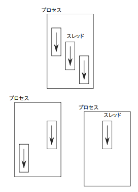
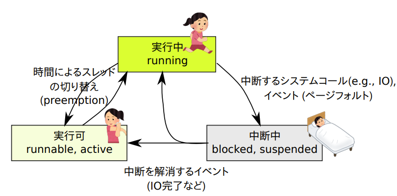
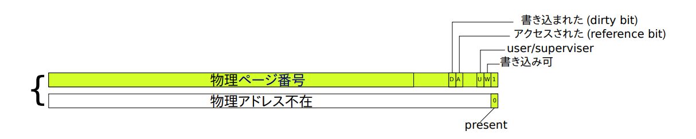
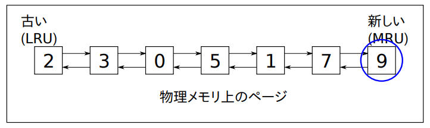
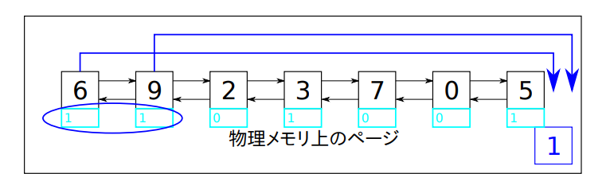
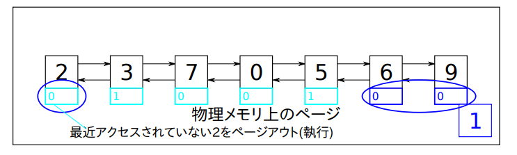
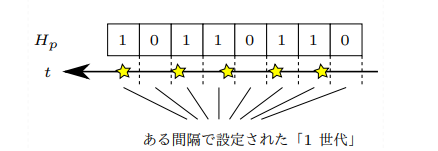
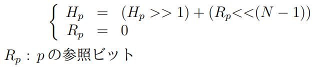
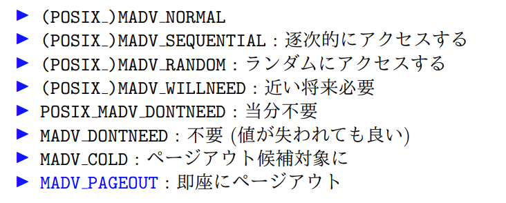

## イントロ
- オペレーティングシステム: Windows, MacOS, Linux, BSD, iOS, Androidなど
  - アプリケーションを動かすためのソフトウェア (基本ソフトウェア)
  - 存在理由:
    - 抽象化: プログラミングをより簡単にする
    - 効率性: 簡単なプログラムで高速に動作するようにする
    - リソースの保護・管理: リソース(CPU、メモリなど)の独占を防ぎ、公平に割り当てる
  - OSがないとどうなるかを考えることで、その意味を理解することが良い


OSがない場合:
- ユーザのプログラムがCPU(プロセッサ)上で直接動く
- 以下のようなことが非常に困難になる
  1. CPU(計算のための資源)を公平に分配すること
  2. メモリ(記憶のための資源)を安全に分配すること
  3. 外部ストレージを安全に分配すること
  4. 入出力

OSがないと. . .
- CPU (プロセッサ) 上に直接ユーザのプログラムが動く
- CPU (計算のための資源) を公平に分け合うことが困難
- メモリ (記憶のための資源) を安全に分け合うことが困難
- 外部ストレージを安全に分け合うことが困難
- 入出力が複雑

OSの機能
- CPU を分け合う: **プロセス, スレッド**
- メモリを分け合う: **プロセス (アドレス空間), 仮想記憶**
- ストレージを分け合う: **ファイルシステム, システムコール**
- 入出力: **ファイルシステム, プロセス間通信**


CPUの特権モード・ユーザモード

- CPU の動作モードに (少なくとも)2 種類ある
- ユーザモード
- 特権モード (スーパバイザモード)

両者の主な違い
1. 一部の命令が特権モードでしか実行できない (特権命令)
2. 一部のメモリ領域に「ユーザモードでアクセス不可」という属性をつけられる

OSのデータやプログラムがOS以外のプログラムには読み書き不能な仕組み
- OSが管理する領域を「ユーザモードでアクセス不可」
- OS以外はユーザモードで動作

下手に設計すれば, 結局誰でも特権モードで好きな命令を実行可能になる危険 → トラップ命令

トラップ命令
- 以下の2つを行う
  1. ユーザモードから特権モードへ移行
  2. ある定められた番地へジャンプ
- x86の場合
  - int 0x80h命令
  - syscall命令
- ある定められた番地は「**割り込みベクタ**」と呼ばれるメモリ上の配列に登録されており、OSが起動時に設定する
- ユーザプログラムからOSへの「入り口」 = **システムコール**

システムコール
- OS がユーザに対して提供している (根源的な) 機能
  - open, write, read, close, fork, exec, wait, exit, socket, send, recv, etc
  - 本当にシステムコールが呼び出されている瞬間は, トラップ命令で OS 内の命令に突入する瞬間

- OS内には多数の機能が存在するが、ユーザプログラムから「入り口」は1つだけ存在する
- 唯一の入り口から分岐してシステムコールがすべての機能ごとに実行されている
- ユーザプログラムが正規の入り口(システムコール)を通らずに特権モードに移行することはできない
- OS内部のプログラム(特権モードで実行される)をしっかり書けば、OSを保護することが可能


## プロセス

- プログラム: 実行すべき命令が書かれているもの。Firefox, シェル (bash), ls, a.out などが含まれる。実体はファイルとして存在する。
- プロセス: プログラムが実行されているもの。メニューからアプリを起動したり、コマンドプロンプトからコマンドを実行するたびに作られる。

例:
- プログラム ≈ マニュアル
- プロセス ≈ マニュアルに従って働いている人

- プロセスの役割
  - CPU を分け合うための抽象化
  - ユーザがプロセスを作ることができる
  - 各プロセスは全力で動かせば良い (他のプロセスに CPU を譲る必要はない)
  - OS がプロセスに CPU を与えたり奪ったりすることができる
  - メモリを分け合うための抽象化 (アドレス空間)
  - 他のプロセスのメモリにアクセスすることはできない, 壊すこともできない

```shell
$ ps auxww
$ ps auxww | grep ssh # ssh 走ってるか?
$ ps auxww | grep tau # ユーザtau のプロセス
$ pgrep -f ssh # \simeq ps + grep
$ pgrep -f tau
```

- プロセスID (PID)
  - 存在する全てのプロセスに付けられた一意な識別子
  - Linux では通常、4194304 までの整数
  - 外から強制終了する場合などに必要


- manコマンド（略）

#### Unix: プロセス関連のシステムコール
- fork: プロセスを作る (コピーする)
- execve: 現在のプロセスで指定のプログラムを実行する
  - 変種: exec{v,l}p?e? (引数の渡し方, 微妙な意味の違い)
  - 総称して exec と呼ぶ (exec という名前の関数はない)
- exit: 現在のプロセスを終了する
- waitpid: 子プロセスの終了待ち + 処理
  - 変種: wait, wait3, wait4


- 子プロセスの生成
  1. fork 実行によりプロセスが複製される
  2. 親プロセスと子プロセスの両方が fork の続きを実行する

- 子プロセスの終了
  1. 子プロセスが終了する (exit を呼ぶ, main 関数が return するなど)

- 処理
  1. 親プロセスが処理をするまで (wait, waitpid などを呼ぶ)
  2. 子プロセスは「ゾンビ (プロセス番号だけが存在する) 状態」
  3. 親プロセスが処理を終えるとすべてがなくなる

#### fork
- 呼び出したプロセスを複製
- fork() の続きが 2 プロセス (親と子) で実行される
- 親と子で返り値だけが違う
  - 親: 子プロセスのプロセス番号
  - 子: 0

[Man page of FORK](https://linuxjm.osdn.jp/html/LDP_man-pages/man2/fork.2.html)
```C
#include <sys/types.h>
#include <unistd.h>

pid_t pid = fork();
if (pid == -1) {
失敗 (子プロセスは作られていない)
} else if (pid == 0) { /* child */
子プロセス
} else { /* child */
親プロセス
}
```

#### exit
- exit を呼んだプロセスを, 指定した終了ステータス(exit status:0~255 の整数) で終了させる
- 当然ながら exit 呼び出し以降は実行されない
- main 関数が終了した場合も同じ効果 (従って main 関数の最後にわざわざ呼ばないのが普通)
  - main の返り値 (return value) が exit status
- exit status は親プロセスが取得可能

#### waitpid
- 基本は子プロセスの終了待ちと処理(ゾンビ状態を解消、プロセス番号の回収)
- 子プロセスの終了待ち方法についての指定が可能 (特定のプロセス、全て、など)
- 終了を待つか待たないかも指定可能

[Man page of WAIT](https://linuxjm.osdn.jp/html/LDP_man-pages/man2/wait.2.html)
```C
#include <sys/types.h>
#include <sys/wait.h>

int ws; // wstatus の意味
pid_t pid = -1; /* -1 : どの子プロセスでも... */
int options = 0; /* 0 : 終了するまで待つ */
pid_t cid = waitpid(pid, &ws, options);
if (cid == -1) {
失敗;
} else {
... ws に, 子プロセスcid に何が起きたかの情報 ...
}
```

- ゾンビ (defunct)
  - プロセス C がゾンビ (defunct) の意味は、C が終了しているが、その親が (waitpid などで)C の終了を確認していない状態
  - 本質的には、C のプロセス番号を再利用できない状態
  - waitpid が「C が終了した」と親に知らせるまでは、C のプロセス番号を他のプロセスに再利用すると、プロセス番号からプロセスを一意に特定できなくなるため
  - waitpid ≈ お葬式; 子プロセスに「成仏」「輪廻転生」してもらう

- Q. 子が終了する前に親が waitpid 等を呼んだら？
  - A. 子が終了するまで return しない（wait の意味通り）

- Q. 子が終了する前に親が終了できる？
  - A. できる

- Q. その場合, 誰がその子の葬式をする (その子はゾンビ状態のまま)？
  - A. 先祖のプロセス(init)が子の親となる

[fork_wait.c](https://github.com/maronuu/operating_system_exercise/blob/main/process/fork_wait.c)
```C:fork_wait.c
#include <err.h>
#include <stdio.h>
#include <stdlib.h>
#include <sys/types.h>
#include <sys/wait.h>
#include <unistd.h>

int main() {
  pid_t pid = fork();
  if (pid == -1) {
    err(1, "fork");
  } else if (pid == 0) {
    // child
    for (int i = 0; i < 5; ++i) {
      printf("This is child (%d): %d times\n", getpid(), i);
      fflush(stdout);
      usleep(100 * 1000);
    }
    return 123;  // my status
  } else {
    int ws;
    printf("parent: wait for child (pid=%d) to finish\n", pid);
    pid_t cid = waitpid(pid, &ws, 0);
    if (WIFEXITED(ws)) {
      printf("exited, status=%d\n", WEXITSTATUS(ws));
      fflush(stdout);
    } else if (WIFSIGNALED(ws)) {
      printf("killed by signal %d\n", WTERMSIG(ws));
      fflush(stdout);
    }
  }
  return 0;
}
```

#### exec - 子プロセスの生成
1. fork ～ プロセスが複製される. 親と子が両方,fork の続きを実行
2. 子プロセスが exec を実行

- 現プロセスで, 指定したプログラムを実行する
- 注意事項:
  - exec の呼び出した後の部分(上記のもの以降)は実行されない
  - 呼び出したプロセスは現在の情報をすべて忘れて、指定されたプログラムを実行するだけの新しいプロセスとして生まれ変わる
  - exec は子プロセスを作らない

execの変種くんたち：exec{v,l}p?e?
- execv, execve, execvp, execvpe, execl, execle, execlp
- execve だけがシステムコール, 残りはそれの亜種
- v と l : 引数の渡し方 (v : 配列; l : 引数のリスト)
- p : 環境変数 PATH を参照してコマンドを検索する
- e : 子プロセスの環境変数を指定する (ない場合は親を引き継ぐ)

[Man page of EXEC](https://linuxjm.osdn.jp/html/LDP_man-pages/man3/exec.3.html)
```C
#include <unistd.h>

execv("ls", argv); // NG
execv("/bin/ls", argv); // OK
execvp("ls", argv); // OK
```

[fork_exec.c](https://github.com/maronuu/operating_system_exercise/blob/main/process/fork_exec.c)
```C:fork_exec.c
#include <err.h>
#include <stdio.h>
#include <stdlib.h>
#include <sys/types.h>
#include <sys/wait.h>
#include <unistd.h>

extern char **environ;

int main() {
  pid_t pid = fork();
  if (pid == -1) {
    err(1, "fork");
  } else if (pid == 0) {
    char *const argv[] = {"ls", "-l", 0};
    execvp(argv[0], argv);
    err(1, "execv");
  } else {
    int ws;
    pid_t cid = waitpid(pid, &ws, 0);
    if (WIFEXITED(ws)) {
      printf("exited, status=%d\n", WEXITSTATUS(ws));
      fflush(stdout);
    } else if (WIFSIGNALED(ws)) {
      printf("killed by signal %d\n", WTERMSIG(ws));
      fflush(stdout);
    }
  }
  return 0;
}
```


## スレッド
- スレッドはCPUを分け合うための抽象化
- スレッドがなければCPUは割り当てられず計算ができない
- CPUコアをN個使用したい場合はN個以上のスレッドが必要
- 1つのプロセスには複数のスレッドが存在することがあり、プロセスを作ると必ず1つのスレッドができる
  - C言語ではmain関数を実行するスレッドがある

**プロセス = アドレス空間 (箱) + 1 つ以上のスレッド **
- CPU ⊃ 物理コア ⊃ 仮想コア
  - スレッドに「CPU を割り当てる」と言うが実際に割り当てているのは, 1 つの仮想コア

スレッドを観察するコマンド
```shell
# Unix CUI
$ ps auxmww
$ top -H
# Linux
/proc/pid/task/tid
```

Unix: スレッド関連のAPI
- POSIX スレッド (または単に Pthreads) (Portable Operating System Interface (Unix系 OS 共通の API 仕様) )
- pthread_create : スレッドを作る
- pthread_exit : 現スレッドを終了
- pthread_join : スレッドの終了を待つ

スレッドの生成～終了～処理
1. pthread_create() により、子スレッドが生成される。
2. 子スレッドが終了する (pthread_exit() を呼ぶ、または子スレッド生成時に指定した関数が終了)。
3. どれかのスレッドが pthread_join() を呼ぶ

#### pthread_create()
- `pthread create(tid, attr, f, arg)`
  - f(arg) を実行するスレッド (子スレッド) を作る
  - pthread create 呼び出し以降と, f(arg) が並行して実行される
  - f は void* を受け取り void* を返す関数
  - スレッドの開始関数と呼ぶ
  - 諸々の属性を attr で指定
  - pthread_create の return 後, 子スレッドの ID が*tid に書き込まれる

#### pthread_exit()
- `pthread exit(p)`
  - pthread exit を呼んだプロセスを, 指定した終了ステータス p で終了させる
  - p : ポインタ (void * )
  - スレッドの開始関数が終了した場合も同じ効果
  - 開始関数の返り値 (return value) が終了ステータス
  - p は `pthread_join` で取得可能

#### pthread_join()
- `pthread join(tid, q)`
  - 子スレッド tid の終了を待つ
  - tid の終了ステータスが* q に返される
  - waitpid のスレッド版だが細かい違い
    - `pthread join(tid, q)` を呼ぶのは, tid の親スレッドである必要はない (同じプロセス中のどのスレッドでもよい)

### プロセス vs. スレッド
- 同じプロセス内のスレッドは「アドレス空間」を共有する
  - ≈ プログラム内のデータを共有する
  - ≈ あるスレッドが書き込んだ値は他のスレッドも自動的に観測する

- 複数のプロセスはそれぞれ独立した「アドレス空間」を持つ
  - ≈ プログラム内のデータは共有されない
  - ≈ あるプロセスが書き込んだ値が他のプロセスに観測されることはない
    

[Man page of PTHREADS](https://linuxjm.osdn.jp/html/LDP_man-pages/man7/pthreads.7.html)

[measure_pthread.c](https://github.com/maronuu/operating_system_exercise/blob/main/thread/measure_pthread.c)
```C:measure_pthread.c

#include <err.h>
#include <pthread.h>
#include <stdio.h>
#include <stdlib.h>
#include <time.h>

long cur_time() {
  struct timespec ts[1];
  clock_gettime(CLOCK_REALTIME, ts);
  return ts->tv_sec * 1000000000L + ts->tv_nsec;
}

void* do_nothing(void* arg) {
    pthread_t tid = pthread_self();
    printf("thread[%lu]: do_nothing called\n", tid);
    return arg;
}

int main(int argc, char** argv) {
  int n = (argc > 1 ? atoi(argv[1]) : 5);
  long t0 = cur_time();

  /* ここにプログラムを書く */
  pthread_t threads[n];
  void *ret;
  for (int i = 0; i < n; ++i) {
    if (pthread_create(&threads[i], NULL, do_nothing, NULL)) {
      err(1, "pthread_create");
    }
    if (pthread_join(threads[i], ret)) {
      err(1, "pthread_join");
    }
  }

  long t1 = cur_time();
  long dt = t1 - t0;
  printf("%ld nsec to pthrea_create-and-join %d threads (%ld nsec/thread)\n",
         dt, n, dt / n);
  return 0;
}
```


## スケジューリング
- OS の重要な仕事 : スレッドに CPU(仮想コア) を割り当てる
  - 基本 : かわりばんこ (round robin)
- 文字通り存在するすべてのスレッド (> 1,000個は当たり前) に均等時間ずつではない

スレッドの状態：以下の 3 つの状態を区別している
- 実行中 (running)
- 実行可能 (runnable, active)
- 中断中 (blocked, suspended)



- スレッドが中断する時の例:
1. OS が, 現在実行中のスレッドがこれ以上実行不能と判断する時
2. read, recv などブロッキング I/O で読むデータがない
3. waitpid, pthread join などで, 子プロセス・スレッドが終了していない
4. pthread mutex lock, pthread cond wait など同期 API で同期が成立していない
5. sleep, usleep, nanosleep など休眠 API
6. ページフォルトで I/O が発生
- OS は, 現在実行中のスレッドから, 別のスレッドに切り替える (コンテクストスイッチ)

ほとんどのスレッドは中断している
- ps auxww, top コマンドの STAT 欄
  - R 実行中または実行可
  - S 中断中 (割り込み可能)
  - D 中断中 (割り込み不可能)
  - その他 . . .
- S と D の違いはあまり気にしなくて良い. D はそれほど
  見かけない
- Unix の load average (負荷平均) = R か D 状態にあるスレッド数 ≈ R 状態にあるスレッド数 (の最近何分かの平均)

タスクキュー、ランキュー（FIFOとは限らない）
- 実行中・実行可状態のスレッドを維持する
- OS はスレッドを切り替える際, ランキュー中から, **ある基準**に従って次のスレッドを選んで実行する

#### ランキューの動き
- ランキューには実行可・実行中のスレッドが入っている
- 実行中のスレッドが中断 → ランキューから外れる
- ランキューから次のスレッドが選ばれて実行される
  - 中断中のスレッドが再開 → ランキューに挿入される
  - タイマ割り込み → 実行中のスレッドが十分な時間を消費していたら, **preemption**
- ランキューから次のスレッドが選ばれて実行される

#### Preemption (横取り)
- スレッドが自発的に OS に制御を渡さない (なにもシステムコールを呼ばずに走り続けている) 状態でも, 強制的に制御を奪うこと (≡ preemption)
- preemption を行うスケジューラ ≡ preemptive なスケジューラ
- 今日の OS のスケジューラは事実上すべてが preemptive
- preemption を実現する仕組み: **タイマ割り込み**

#### タイマ割り込み
仮想コアは以下を繰り返す
```C
while (1) {
  PC の指すアドレスから命令を読む
  命令を実行する (一部のレジスタが書き換わる, PC 含め)
  if (割り込みが来た) {
    PC := 割り込みベクタ [割り込み番号];
  }
}
PCはプログラムカウンタレジスタのこと
```

スレッド選択
- OS はスレッドを切り替える際, ランキュー中から, **ある基準**に従って次のスレッドを選んで実行する
- **ある基準**の例
  - Round Robin (純粋なかわりばんこ)
    - ランキューが純粋な FIFO
    - 中断から回復したらキューの末尾に入る
    - 実行中のスレッドの time quantum が expire したら末尾に入る
    - 次のスレッドを選ぶ際はキューの先頭が選ばれる
    - 問題
      - 公平性: 「中断していた ⇐⇒ CPU を使っていなかった」スレッドも「preempty された ⇐⇒ ずっと CPUを使っていた」スレッドも同じ扱い
      - 対話的なプログラムの応答性: 実行可のスレッドが多い(load average が高い) と, それに比例して, 「応答時間 = 中断状態から再開してから実行されるまでの時間」が長くなる
  - Linux Completely Fair Scheduler (CFS)
    - Linux 2.6.23 以降のデフォルトスケジューラ
    - 各スレッドが「**消費した合計 CPU 時間 (→ vruntime)**」を管理
    - スレッド切り替え (実行中スレッドが中断した, 中断中スレッドが復帰した, タイマ割り込みがおきた, など) 時に, 実行可能スレッド中で vruntime が最小のスレッドを次に実行する
      - 注: ランキューを, vruntime の小さい順にスレッドが並ぶ優先度キューとすれば実現可能
    - 長い目で見て, 各スレッドへの CPU 割当時間を均等にすることができる → 公平
    - しばらく中断していた (CPU を使っていなかった) スレッドが再開した時, その間実行されていたスレッドよりも vruntime が小さいことが期待される→ 対話的スレッドの応答性が高い

#### vruntime
1. 生成時は親の vruntime を継承. 親スレッド A が子スレッド B を生成

$$
B.vruntime = A.vruntime
$$

2. タイマ割り込み, スレッド中断時に, 実行中だったスレッド T の vruntime を加算.

$$
T.vruntime += T が今回消費した CPU 時間
$$

3. スレッド T が中断から復帰する時は, T の vruntime が他の実行可・中スレッドよりも極端に小さくならないことを保証

$$
T.vruntime = \max(T.vruntime, \min_{t:実行可}
t.vruntime−20 ms)
$$


# section 4 (null)

# 論理アドレス空間

**プロセスごとに**論理アドレス（↔物理アドレス）空間を作る

論理アドレスの範囲は物理メモリの量によらず、OSによって決まり、論理アドレスと物理アドレスの変換はCPUが行う。**対応する物理アドレスが存在するとは限らない**。

# メモリ管理ユニット(MMU)
CPU内のハードウェアでメモリアクセスに介在する。論理アドレスに対して、
1. アドレス権の検査
2. 対応する物理アドレスの有無の検査
3. 存在していればアクセス
を行う。
MMUによって
1. プロセス間でメモリの分離
2. カーネルの保護
3. 物理メモリ量を超えたメモリ割り当て
4. 要求時ページング
   1. 物理メモリを確保せずに論理アドレスを割り当てる（高速）
が行える

## アドレス交換のやり方
論理アドレス → 物理アドレス/アクセス許可への写像を作る
すべてのアドレスに対応する情報をもたせるのは非現実的なので、ページングを行う。

$$ 2^{48}\times 8 \times Process = 2PB \times Process $$

最下位Abit(大体12bit or 13bit)**以外共通**の2^A個のアドレスからなる領域をページと言う。ページのサイズが大きいほど、ページテーブルのサイズが小さくなるので、メモリの節約になる。ページのサイズが小さいほど、ページテーブルのサイズが大きくなるので、ページテーブルのアクセスが遅くなる。

アクセス許可情報や、物理アドレス（オフセット以外）は、ページごとに一つもたせる。
これで必要なものは、以下の写像になる。

論理ページ → アドレス許可/物理ページ番号

この論理ページto物理ページ番号をページテーブルという形で実現する。ただし、論理ページ番号をただの配列とすると2^36個の要素をもつ配列が必要になるので、ページテーブルは多段ページテーブルで実現される。例えば

2^9 -> 次の2^9 -> 次の 2^9 -> 次の2^9

というふうに4段にする。最悪の場合、512GB必要なのは変わらないが、ほとんどのプロセスは論理アドレス空間のごく一部しか使わないので、下位の表は殆どの場合不要になり、多段ページテーブルの場合、効率が良い。（不要なページテーブルは作成しないので）

## ページテーブルエントリ
ページテーブルのエントリは、以下のようになる。
- P : 1ならページが存在する
  - W : 1なら書き込み可能
  - U : 1ならユーザープロセスからアクセス可能
  - A : 1ならアクセスされた
  - D : 1なら書き込みされた
  - PFN : 物理ページ番号



# TLB(Translation Lookaside Buffer)
毎回論理アドレスの変換のために4回メモリアクセスはだるい
→TLB（CPU内のキャッシュ）内に一部の写像を保存しておく（1024個程度 36bit x2 x 1024 = 9KiB程度？）

# UNIXのメモリ割当API
- `brk(l)`
  - データセグメントの終わりのアドレスをlにする。
- `sbrk(sz)`
  - プロセスのデータセグメントの境界をszだけ伸ばす
  - `sbrk(0)`で現在のデータセグメントの終わりのアドレスを返す

- `mmap, mremap, munmap` 
  - めっちゃ大事なやつら

- `mprotect(a, sz, prot)`
  - メモリ領域aからszバイトのメモリ領域のアクセス権をprotに変更する

メモリを割り当てることによって、**論理アドレスの範囲がアクセス可能になる**。実際にはアドレス空間表に割り当て済みであることを記述するだけで、アクセス発生時にメモリが割り当てられる。

## ページアウト/ページイン
物理メモリが足りなくなったときに、ページアウトを行う。ページアウトは、ページテーブルの物理ページを不在とし、次にアクセスする際にページフォルトが起こるようにしておく。ページアウトされたページは、ページインされるまで、物理メモリには存在しない。

# 資源使用量やメモリの割当状況をしるAPI
- `getrusage`
  - プロセスの資源使用量を返す
- `setrlimit`
  - プロセスの資源使用量の上限を設定する
- `prlimit`
  - プロセスの資源使用量の上限を取得する
- `mincore`
  - メモリ領域のページの存在状況を返す
  - `mincore(addr, len, vec)`で、addrからlenバイトのメモリ領域のページの存在状況をvecに書き込む

# cgrouops
- `cgroup`は、Linuxカーネルの機能で、プロセスのグループを作成し、グループ内のプロセスに対して、資源使用量の上限を設定することができる。

`/sys/fs/cgroup/hoge/`に、`cpu.cfs_quota_us`と`cpu.cfs_period_us`を書き込むことで、CPU使用量の上限を設定できる。`cpu.cfs_quota_us`には、CPU使用量の上限をマイクロ秒単位で書き込む。`cpu.cfs_period_us`には、CPU使用量の上限を計算する周期をマイクロ秒単位で書き込む。`cpu.cfs_quota_us`には、`cpu.cfs_period_us`の周期で、`cpu.cfs_quota_us`マイクロ秒までCPUを使用できる。`cpu.cfs_quota_us`には、`cpu.cfs_period_us`の周期で、`cpu.cfs_quota_us`マイクロ秒までCPUを使用できる。`memory.high`でメモリの使用量の上限を設定できる。

# ページ置換アルゴリズム
物理メモリが足りなくなったときに、どのページをページアウトするかを決めるアルゴリズム。
ページ置換が頻繁に起こる状態をスラッシングという。

オフライン問題（将来のアクセス系列をすべて知っている）に対する最適アルゴリズムは、 $a_i \notin R_i$のときに、常駐ページのうち、次にアクセスされるまでの時間が最も長いページを置換するというもの。 

オンライン問題に対しては、どんなアルゴリズムにしようと最悪のケース（ページフォルト率1）は、避けられない。仕方ないので、**最近使われたものはまたすぐ使われる**という予想をする。（LRU, FIFO, LRUの近似, エイジング）

## LRU
LRUの根拠として、空間局所性及び時間局所性があげられる。未来のアクセスが過去のアクセスの反転であるとして最適アルゴリズムを適用しているのと同じである。

LRUはこんな配列を用意して、新しいのが出たら後ろに追加し、古いのを追い出す。既存のなら、後ろに移動して、前を詰めるという動作をする。



ページへのアクセスのたびにデータ構造を変更する必要があり、特別なハードウェアの仕組みが必要。（メモリアクセスのたびに介入）→NRUでは、最近に使われたものをざっくりと把握する。

## FIFO
先入れ先出し方式。LRUと異なるのはすでにページとして存在するものへのアクセスの場合、物理メモリ上のページを書き換えないことである。問題点は、ページインしてから使われたものとそうでないもの（しばらく放置されているもの）を区別できないところ。

## セカンドチャンス
物理メモリ上にあるページにアクセス時、MMUがそのページの参照ビットを1にする(1のときはそのまま)。ページアウトが必要なとき、リストの先頭の参照ビットが0ならば、そのページをアウトする。参照ビットが1ならば、参照ビットを0にして、リストの末尾に移動する（セカンドチャンス）。結果的に、参照ビットが0のページでもっとも古いものがアウトされる。




### セカンドチャンスの限界
P(ページテーブルのサイズ)回のページフォルトより短い粒度や、それ以前のアクセス履歴は用いていない。

## クロックアルゴリズム
動作はセカンドチャンスと同じで、二重リンクリストの代わりに循環バッファを使う

## エイジング
物理メモリ上の各ページに、一定間隔の区間ごとのアクセスあり・なしをN世代分記録したカウンタ値Hpを持たせる。



1世代 = 一定の実時間かページ置換回数で区切る

世代が変わるとき、Hpをdecayさせ、直近のアクセスあるなしを反映



ページ置換時には、カウンタ値Hpが最も小さいページを置換する。

## 実際の実装における考慮
ページアウトは物理メモリが枯渇する前にページフォルトと非同期に始める。ページアウト対象を選ぶ際は、最近のページのアクセスの有無だけでなく、二次記憶への書き込みが必要かどうかも考慮する必要がある。
- 初めてページアウトされるとき
- ページインから変更されているとき

は書き込みが必要であり、IOが発生する。

ページアウトは1ページ毎ではなく、連続した数十ページをまとめて行ったほうがIOの効率が良い。

# ページング制御API
`posix_madvise(addr, len, advice)`、`madvise(addr, len, advice)`でページング制御を行える。
後者はLinux特有で、機能が多い。



# ファイルディスクリプタと疑似ファイル

## Unixの特徴
### 1. 出力先の変更
Terminalに出力するつもりでプログラムを書けば、それがそのままファイルを出力するプログラムになる

```c
int main() { printf("hello\n"); }
```

```bash
$ ./hello
hello
```
出力先をredirect
```bash
$ ./hello > out.txt
```

### 2. 入力先の変更
同様に入力も。
```bash
$ cat content.txt
hello hiroshi
$ ./say_something < content.txt
hello hiroshi
```

### 3. パイプでプロセス間通信
ex
```bash
ps auxww | grep firefox
```

プロセス外部とのやりとりはすべてファイルディスクリプタを経由して行われる。

everything is file
- プロセスごとにアドレス空間は分離されている
- fdに `read/write`を発行して通信しよう


## リダイレクト・パイプの仕組み
### 子プロセスにfdを継承する
```c
int fd = open(...);
pid_t pid = fork();
if (pid == 0) {
    // child
    read(fd, buf, sz); // OK
}
```
childの中でexecしても有効なので、execした先でもfdの値さえ分かれば openした内容を使える。

### 標準入出力
- fd=0: 標準入力
- fd=1: 標準出力
- fd=2: 標準エラー出力

### ファイルAPI(高水準)
生のfdに対応する高水準APIがC言語では提供されている
```c
FILE *fp = fopen(filename, mode);
fread(buf, size, n, fp);
fwrite(buf, size, n, fp);
```
日本語記事: https://programming-place.net/ppp/contents/c/040.html#rw_open

### `dup2` システムコール
```c
int err = dup2(oldfd, newfd);
```
ファイルディスクリプタ`oldfd`を`newfd`でも使えるようにする(複製)。

#### 入力リダイレクト`cmd < filename`の実現方法
```c
const int fd = open(filename, O_RDONLY);
pid_t pid = fork();
if (pid) {
    // parent
    close(fd); // 親には不要
} else {
    // child: fd -> 0へ付け替えて、0(stdin)で読めるように
    if (fd != 0) {
        dup2(fd, 0);
        close(fd);
    }
    execvp(cmd, ...);
}
```
#### 出力リダイレクト`cmd > filename`の実現方法
```c
const int fd = creat(filename); // 新しいfdを生成
pid_t pid = fork();
if (pid) {
    // parent
    close(fd); // 親には不要
} else {
    // child: fd -> 1へと付け替えて、1(stdout)に吐けるように
    if (fd != 1) {
        close(fd);    // ここの順序は先にcloseしないとバグるのかは不明
        dup2(fd, 1);
    }
    execvp(cmd, ...);
}
```

### `pipe`システムコール
```c
int rw[2]; // fdの配列
int err = pipe(rw);
```
`rw[0]`, `rw[1]`にそれぞれ読み出し・書き出し用のfdが生成される。
`rw[1]`に書いたデータが`rw[0]`から呼び出せる。
これをforkによるfdの継承を使って、親子プロセス間通信を実現。

#### pipe (親 -> 子)
親がwに書き出したものを、子がstdio(0)から読めれば良い
```c
int rw[2]; pipe(rw);
int r = rw[0], w = rw[1];
pid_t pid = fork();
if (pid) { // parent
    close(r); // 親はreadは不要
    // WRITE to `w` here
    close(w);
} else { // child
    close(w); // 子はwrite不要
    dup2(r, 0);
    close(r);
    execvp(...);    // stdio(0)から読むコマンド
}
```
#### pipe (子 -> 親)
子がstdout(1)に書き出したものを、親がrから読めれば良い
```c
int rw[2]; pipe(rw);
int r = rw[0], w = rw[1];
pid_t pid = fork();
if (pid) { // parent
    close(w); // 親はwrite不要
    // READ from `r` here
    close(r);
} else { // child
    close(r); // 子はread不要
    dup2(w, 1);
    close(w);
    execvp(...);    // stdout(1)へ書き出すコマンド
}
```
例: `popen`ライブラリ関数

## 疑似ファイル
2次記憶上のデータに限らず、openしてread/writeできるものは全てファイルとする。

- 名前付きパイプ(FIFO)
  - `int err = mkfifo(pathname, mode);`
- `/proc`ファイルシステム
  - プロセスやOSの内部状態に関するファイル
- `cgroups`ファイルシステム(詳細は05memory.pdf)
  - プロセスの集合に割り当てる資源を制御する機能
  - `sudo mount -t cgroup2 none dir`
- `tmpfs`
  - 実体がメモリ上にある(揮発)ファイルシステム
- デバイスファイル
  - I/O装置(camera, microphone, ...)もファイルとして扱う
  - 単純な例:
    - `/dev/null`, `/dev/zero`, `/dev/urandom`